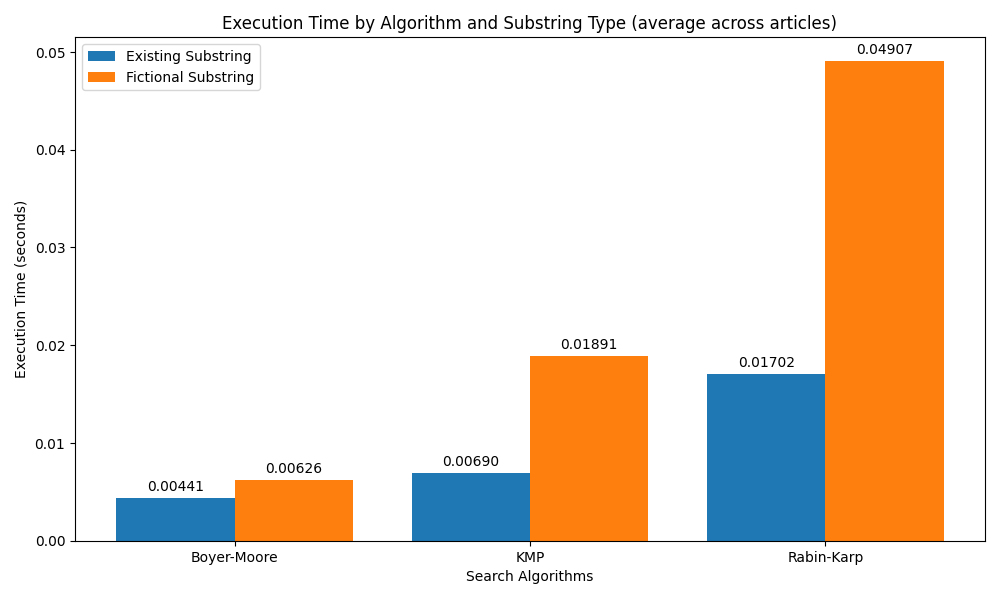

### Envirement setup

```
python -m venv .

source bin/activate

pip install -r requirements.txt
```

### Running scripts

```
# Task 1
python hash_table.py

# Task 2
python binary_search_upper_bound.py

# Task 3
python compare_algorithm_search

```

### Comparison of Substring Search Algorithms: Boyer-Moore, Knuth-Morris-Pratt, and Rabin-Karp:

```
  Article №    Text size  Substring (exiting/fictional)      Boyer-Moore (s)    KMP (s)    Rabin-Karp (s)
-----------  -----------  -------------------------------  -----------------  ---------  ----------------
          1        12656  (True, 'прийма')                          0.007000   0.016964          0.027930
          2        17591  (True, 'прийма')                          0.002192   0.003258          0.008562
          1        12656  (False, 'Профілюванням')                  0.005195   0.015099          0.039270
          2        17591  (False, 'Профілюванням')                  0.007618   0.021364          0.055932
```


